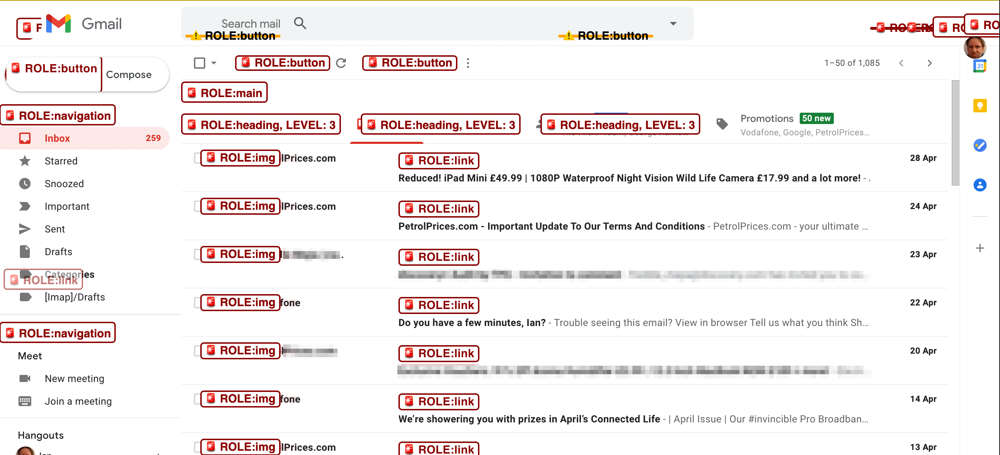

# Diagnostic CSS Files

## Reveal Roles

As inspired by Steve Faulkner's short article [HTML Developers: Please Consider – in the year of 2021](https://html5accessibility.com/stuff/2021/05/01/html-developers-please-consider-in-the-year-of-2021/), this CSS is a diagnostic file that aims to highlight HTML elements that have roles that should probably be native HTML equivalents (indicated in red with 🚨 symbol) or native HTML elements that probably don't need a `role` attribute (indicated in orange with ⚠️ symbol).

You can use the [test markup page](test-markup-roles.html) to verify this is working as it should.

## Structure Outliner

Indicates key structural elements of a page, such as headings, lists, landmarks. 
